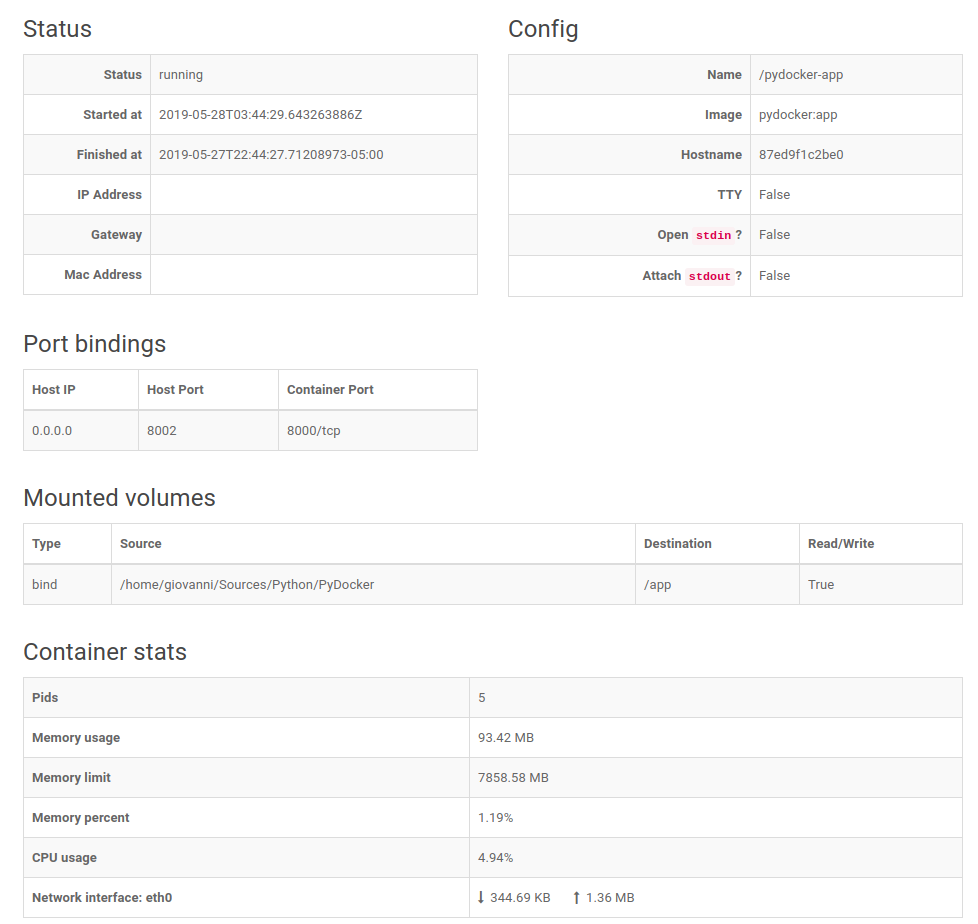

PyDocker
========
Manage docker containers from a human friendly WebUI

## Features
- View all containers and its current status
- Start and stop containers with a single click
- View details about each container such as:
  - Mounted volumes
  - Exposed ports
  - Memory usage
  - CPU usage
  - Network usage
  - Container image
  - Hostname
  - Startup date
- View stats about your containers
- Connect to remote docker servers

## How it looks like?

## How to deploy?
 * Enable Docker API remote access on your server: [Stack overflow link](https://stackoverflow.com/a/43030300/3211029)
 * Clone this project
 * Startup through docker: `cd docker && docker-compose up -d`
 * Go to [localhost:8002](http://localhost:8002)
 * Start hacking!